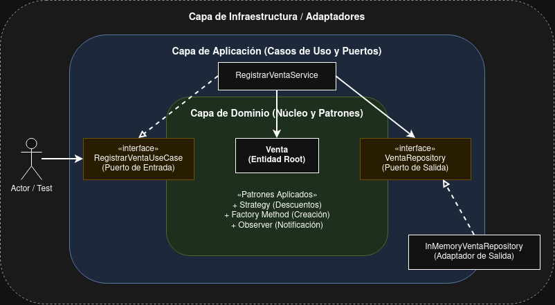

# Guía de Reproducción - P02 Venta en Memoria

## Herramientas y versiones
* Java 11 (SDKMAN)
* Maven
* JUnit 4.13.2

## Comandos para reproducir
1. Ejecutar pruebas automatizadas: `mvn clean test`
2. Verificación de módulo: `./scripts/verify-module.sh M02`

## Calidad y Sonar
* **Estado:** PENDIENTE. 
* **Justificación:** Fallo crítico en la red de Docker (módulo veth) en Arch Linux minutos antes del cierre impidió levantar el contenedor de SonarQube.

## Decisiones Técnicas
* Se implementaron Objetos de Valor (Precio) e Invariantes para proteger el estado de Producto y DetalleVenta.

# Evidencia P03 - Ramas y Calidad

## URL / Identificador
Identificador del commit final: b6dcfd52b09b2e4092824e0ccb96ddbac157310d

## Guía de reproducción
- **Herramientas:** Java 11, Maven 3, Git, SonarQube (Docker)[cite: 4, 5].
- **Comandos de pruebas:** `mvn clean test` y `./scripts/verify-module.sh M03`[cite: 1].
- **Comando de calidad:** `mvn clean verify sonar:sonar -Dsonar.projectKey=tcsw-ventas -Dsonar.host.url=http://localhost:9000 -Dsonar.login=<TOKEN>`

## Justificación técnica (Saber teórico y analítico)
Se identificó que el modelo dependía de valores mutables de precisión limitada y no conservaba el precio histórico. 
Para resolverlo:
1. Se refactorizó `Precio` usando `BigDecimal` inmutable y se validaron entradas nulas o negativas.
2. `DetalleVenta` ahora captura el estado del `Precio` en el momento de creación, protegiendo el historial ante cambios futuros del catálogo.
3. Se provocó un conflicto en Git al modificar concurrentemente validaciones en `Venta.java`, el cual se resolvió manualmente preservando ambas invariantes (rechazo de nulos y cantidades negativas) sin pérdida funcional.

## Índice de Evidencias (Criterios R01)
* **Funcionamiento:** `evidencia_pruebas.png` (Script de verificación exitoso).
* **Solución técnica:** Código fuente en el `.zip` demostrando el uso de `BigDecimal` inmutable.
* **Pruebas:** `evidencia_pruebas.png` (Salida de JUnit y JaCoCo).
* **Calidad y Sonar:** `evidencia_sonar.png` (Reporte limpio en servidor local).
* **Git y evidencia:** `evidencia_git.png` (Grafo y commit de resolución) y carpeta `.git` dentro del proyecto.

# Evidencia Grupal P04 - Flujo Colaborativo GitHub

## Identificadores de Entrega
* **URL del repositorio:** [https://github.com/luis-pseudo/ventas_tecnologias.construccion.git]
* **Etiqueta (Tag) final:** `v1.0.M04`
* **Commit final:** [https://github.com/luis-pseudo/ventas_tecnologias.construccion.git]

## Guía de Reproducción
- **Herramientas:** Java 11, Maven 3, Git, SonarQube.
- **Ejecución de Pruebas:** Desde la raíz del proyecto, ejecutar el comando `./scripts/verify-module.sh M04`.
- **Análisis de Calidad:** `mvn clean verify sonar:sonar -Dsonar.projectKey=tcsw-ventas -Dsonar.host.url=http://localhost:9000 -Dsonar.login=[TOKEN]`

## Índice de Evidencia (Criterios R01)
1. **Funcionamiento:** Se implementó `InMemoryProductoRepository` que satisface el contrato compartido. El script arroja `MODULO_M04_VERIFICADO`. *(Ver enlaces o carpeta de capturas adjuntas)*.
2. **Solución Técnica:** Se usó un adaptador en memoria con protección de mutabilidad mediante `Optional` y colecciones inmodificables. Las decisiones de diseño están fundamentadas en las revisiones en GitHub.
3. **Pruebas:** Se ejecutaron localmente y con el script automatizado. La ejecución resultó aprobada sin errores tras las correcciones de revisión.
4. **Calidad y Sonar:** El análisis estático en SonarQube presenta un resultado concluyente, atendiendo los hallazgos en el tablero del proyecto local.
5. **Git y Evidencia:** El flujo colaborativo se encuentra documentado en los Pull Requests de GitHub. Cada integrante detalla su contribución, rol y trazabilidad técnica en la carpeta `docs/contribuciones/`.

# Evidencia P06 - Patrones para el dominio

## Guía de Reproducción
- **URL del Repositorio:** https://github.com/luis-pseudo/ventas_tecnologias.construccion
- **Commit/Tag Final:** `v1.0.M06`
- **Comprobación:** Ejecutar `./scripts/verify-module.sh M06`
- **Análisis SonarQube:** Ejecutar `mvn clean verify sonar:sonar ...`

## Índice de Evidencia (R01)
* **Funcionamiento:** Ejecución y salida del script de validación.
* **Solución técnica:** Aplicación documentada de patrones en el dominio.
* **Pruebas:** Casos de prueba automatizados en `VentaPatronesTest.java`.
* **Calidad y Sonar:** Captura del análisis limpio.
* **Git y evidencia:** Historial de commits y archivo de contribuciones individuales.

## Análisis de Decisiones y Alternativas (ADR)
1. **Strategy vs Condicionales Directos:**
   - *Problema:* El cálculo de descuentos anidaba múltiples `if/else`, dificultando la prueba aislada.
   - *Alternativa descartada:* Mantener condicionales directos en `Venta`.
   - *Decisión:* Strategy. Permite intercambiar políticas de descuento sin modificar la entidad principal, mejorando la extensibilidad. Costo: Introduce más clases e indirección.
2. **Factory Method:**
   - *Decisión:* Concentra la validación de creación de la entidad `Venta`.
3. **Observer:**
   - *Decisión:* Desacopla la lógica de notificación (ej. envío de correos o auditoría) del flujo de caja, evitando que el dominio conozca infraestructura externa.
4. **Análisis crítico de Singleton y Facade:**
   - *Singleton:* Se rechaza su uso en este núcleo de dominio debido a que introduce estado global mutable, lo cual dificulta las pruebas unitarias concurrentes y oculta las dependencias reales de las clases.
   - *Facade:* Se considera innecesario en esta etapa, ya que la complejidad actual del subsistema de ventas no requiere una interfaz simplificada adicional que oculte interacciones complejas.

# Evidencia C01 - Arquitectura

## Diagrama del proyecto

## Índice de Evidencia (R02)
- **[E01] Modelo de dominio:** Ver clases puras en `src/main/java/mx/uv/tcsw/domain`.
- **[E02] Arquitectura hexagonal:** Aislamiento de capas comprobable en `src/main/java/mx/uv/tcsw/` mediante los paquetes `domain` (núcleo), `application` (puertos) y `adapter` (infraestructura).
- **[E03] Patrones y justificación:** Ver archivo ADR en `docs/c01/documentacion-integrante2.md`.
- **[E04] Pruebas y Calidad:** Ver tests ejecutables y validaciones ArchUnit en `src/test/java/mx/uv/tcsw/`.
- **[E05] Trazabilidad:** Ver directorio `docs/contribuciones/` y etiqueta `v0.1-arquitectura`.